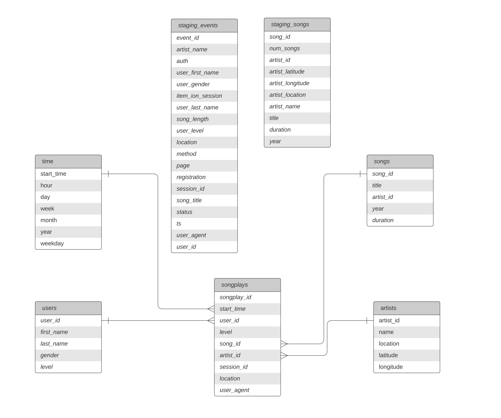

# Sparkify ETL Data Warehouse on Amazon Redshift
This project is part of the Udacity Nanodegree program with AWS. The goal of the project is to build a data warehouse using AWS services such as Amazon S3, Amazon Redshift.

## Project Overview
In this project, we will design and implement a data warehouse solution for a fictional music streaming service called Sparkify. The data warehouse will be used to store and analyze data about user activity on the Sparkify platform.

We will follow these steps to build the data warehouse:

1. Create a data model using a star schema.
2. Extract data from various sources, including log files and song files.
3. Load the transformed data into the data warehouse using Amazon Redshift.

## Project Datasets
* Song data: s3://udacity-dend/song_data
* Log data: s3://udacity-dend/log_data
* This third file s3://udacity-dend/log_json_path.json contains the meta information that is required by AWS to correctly load s3://udacity-dend/log_data

#### Song Dataset: 
It's a subset of real data from [Million Song Dataset](https://labrosa.ee.columbia.edu/millionsong/). Each file is in JSON format and contains metadata about a song and the artist of that song. The files are partitioned by the first three letters of each song's track ID.

Sample Data:
```
{"num_songs": 1, "artist_id": "ARJIE2Y1187B994AB7", "artist_latitude": null, "artist_longitude": null, "artist_location": "", "artist_name": "Line Renaud", "song_id": "SOUPIRU12A6D4FA1E1", "title": "Der Kleine Dompfaff", "duration": 152.92036, "year": 0}
```

## Log Dataset
In this dataset consists of log files in JSON format generated by this  [event simulator](https://github.com/Interana/eventsim)  based on the songs in the dataset above. These simulate app activity logs from an imaginary music streaming app based on configuration settings.

The log files in the dataset are partitioned by year and month. 

Sample Data: 

    {"artist":null,"auth":"Logged In","firstName":"Celeste","gender":"F","itemInSession":0,"lastName":"Williams","length":null,"level":"free","location":"Klamath Falls, OR","method":"GET","page":"Home","registration":1541078e+12,"sessionId":438,"song":null,"status":200,"ts":1541990217796,"userAgent":"\"Mozilla\/5.0 (Macintosh; Intel Mac OS X 10_9_4) AppleWebKit\/537.36 (KHTML, like Gecko) Chrome\/36.0.1985.143 Safari\/537.36\"","userId":"53"}


## Schema for Song Play Analysis



#### Fact Table
1. **songplays** - records in event data associated with song plays i.e. records with page NextSong
    *songplay_id, start_time, user_id, level, song_id, artist_id, session_id, location, user_agent*

#### Dimension Tables 
1. **users** - users in the app *user_id, first_name, last_name, gender, level*
2. **songs** - songs in music database *song_id, title, artist_id, year, duration*
3. **artists** - artists in music database *artist_id, name, location, lattitude, longitude*
4. **time** - timestamps of records in songplays broken down into specific units *start_time, hour, day, week, month, year, weekday*

### Project Structure
* `create_table.py` is where you'll create your fact and dimension tables for the star schema in Redshift.
* `etl.py` is where you'll load data from S3 into staging tables on Redshift and then process that data into your analytics tables on Redshift.
* `sql_queries.py` is where you'll define you SQL statements, which will be imported into the two other files above.
* `README.md` is where you'll provide discussion on your process and decisions for this ETL pipeline.
